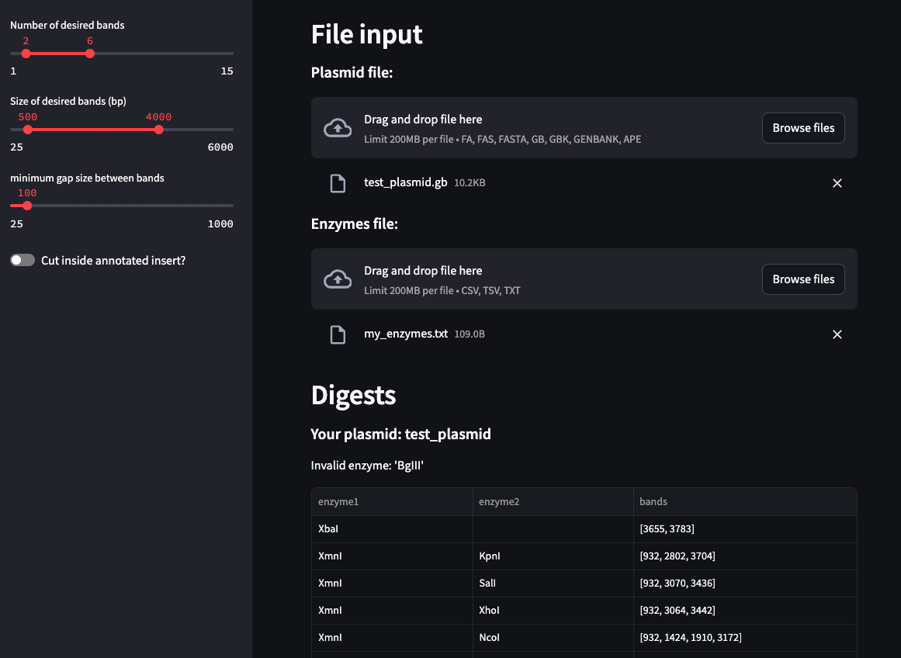

# INdigestion

What this program does:

This is app prints expected gel band sizes from restriction digests. The user specifies which enzymes they have in their lab and what band sizes they prefer. For individuals preferring a graphic user interface, a streamlit version is available which enables user interface using a web browser. 

# Dependencies

This script requires Python 3.10. To install libraries, run:

```sh
pip install -r requirements.txt
```

## Run digest in web browser

```sh
streamlit run stream_digest.py
```



## Run digest on CLI

Minimum input, while specifying enzymes file. (if no -e provided, assumes it is `./test/my_enzymes.txt`)
```sh
python3 INdigestion.py \
  -p ./test/test_plasmid.gb \
  -e ./test/my_enzymes.txt
```

**Files Required for Program to Run:**

1. **Annotated plasmid file.** Must be in genbank, ape, or fasta format. Program will only process circular plasmids. GENE INSERT MUST BE ANNOTATED AS "GENE". This can be done using [Ape (a plasmid editor)](https://jorgensen.biology.utah.edu/wayned/ape/) or a standard text editor. When the -i flag is selected, the program will select enzymes or enzyme pairs that cut at least once within the annotated gene. 
    
2. **CSV with a list of your enzymes.** If you store the file as "my_enzymes.csv" in the same folder as the script, you won't need to use the -e flag to specify where your enzyme file is located. 


**Program Input**

- Plasmid file – Genbank or fasta file containing plasmid sequence
- Enzyme CSV file (“my_enzymes.csv”) – File contains the names of the enzymes you have on hand; update to match your stocks; doesn't need to be included in arguments unless you move it outside the file with the python script


### CLI Examples

view all the options (“--help" = “-h”)
```sh
python INdigestion.py --help
```

Makes sure program is working right (“--test" = “-t”)
```sh
python INdigestion.py --test	
```

Output: 

> ================================================================
> 
>         Displaying enzymes producing between 2 and 6 bands,
>         with sizes between 500 nt and 4000 nt,
>         with at least 100 nt gap between bands.
> 
> ----------------------------------------------------------------
> Your plasmid: test_plasmid
> 
> Invalid enzyme: 'BgIII'
> 
> Bands from XbaI :                [3655, 3783]
> Bands from HindIII + XbaI :      [1068, 2715, 3655]
> Bands from HindIII + XmnI :      [932, 3085, 3421]
> Bands from EcoRV + XmnI :        [932, 1403, 1686, 3417]
> Bands from KpnI + XbaI :         [1351, 2432, 3655]
> Bands from KpnI + XmnI :         [932, 2802, 3704]
> Bands from SalI + XbaI :         [1083, 2700, 3655]
> Bands from SalI + XmnI :         [932, 3070, 3436]
> Bands from XbaI + XhoI :         [1089, 2694, 3655]
> Bands from XbaI + NcoI :         [819, 1054, 1910, 3655]
> Bands from XbaI + ClaI :         [1075, 2708, 3655]
> Bands from XbaI + NdeI :         [760, 3023, 3655]
> Bands from XhoI + XmnI :         [932, 3064, 3442]
> Bands from NcoI + XmnI :         [932, 1424, 1910, 3172]
> Bands from ClaI + XmnI :         [932, 3078, 3428]
> ----------------------------------------------------------------              


Digest must cut within an insert
```sh
python INdigestion.py \
  -p ./test/test_plasmid.gb \
  -i	
```

Digest must cut within insert and produce at least 4 bands
```sh
python INdigestion.py \
  -p ./test/test_plasmid.gb \
  -i \
  -n 4
```
